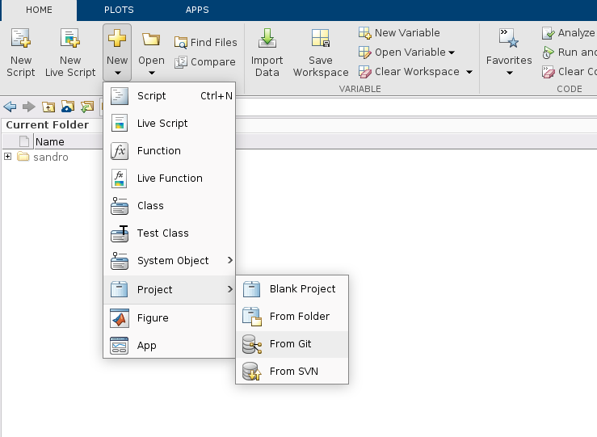
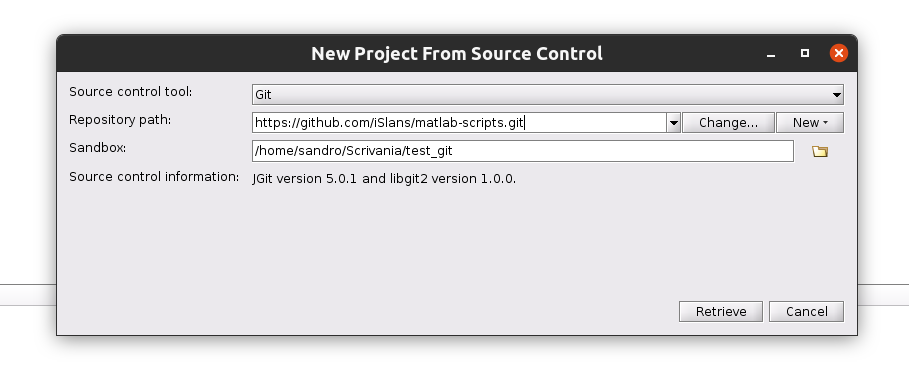
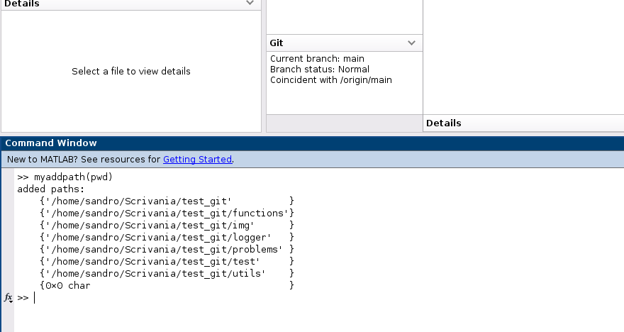
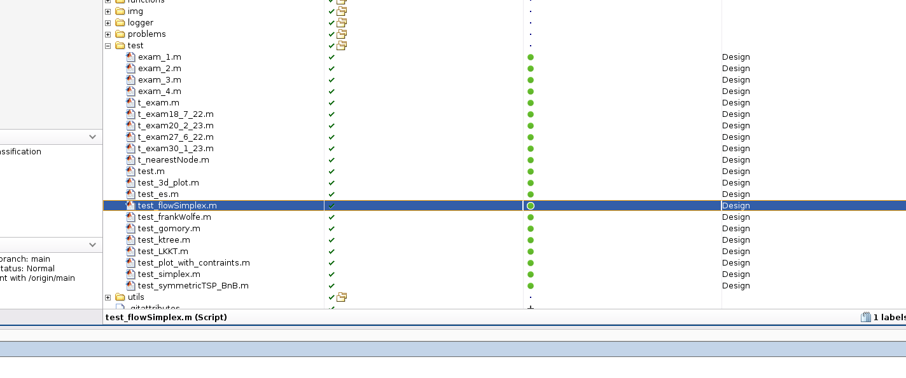
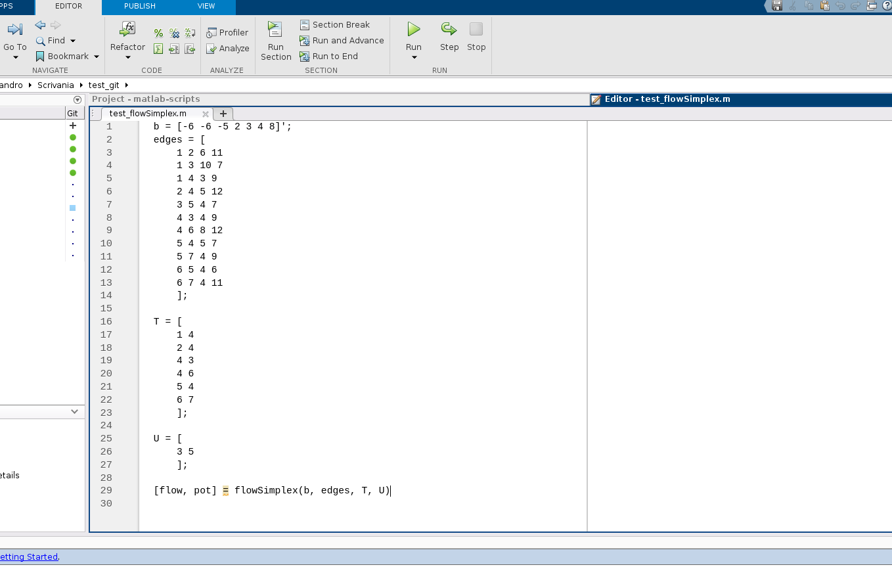
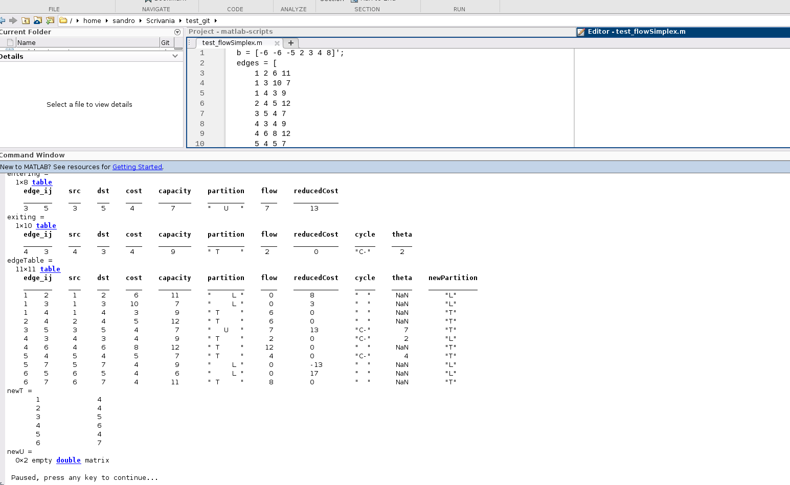
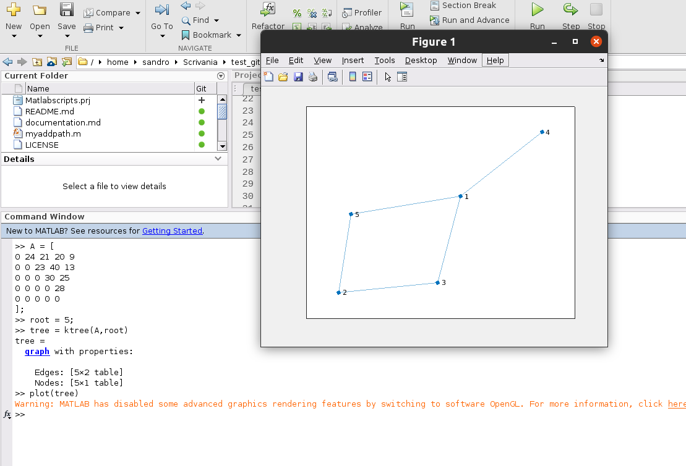

- [Matlab Scripts per Ricerca Operativa](#matlab-scripts-per-ricerca-operativa)
- [What you may be interested...](#what-you-may-be-interested)
  - [images](#images)
- [Documentation](#documentation)
- [Run Locally](#run-locally)
  - [⚠️ Requirements](#️-requirements)
- [Guida come scaricare e usare questo progetto (per chi non sa ancora usare git e/o matlab)](#guida-come-scaricare-e-usare-questo-progetto-per-chi-non-sa-ancora-usare-git-eo-matlab)
  - [1. Scaricare questo progetto](#1-scaricare-questo-progetto)
  - [2. Usare le funzioni](#2-usare-le-funzioni)
    - [A) eseguire un file di test già pronto](#a-eseguire-un-file-di-test-già-pronto)
    - [B) eseguire i comandi](#b-eseguire-i-comandi)

# Matlab Scripts per Ricerca Operativa

Scripts per risolvere i problemi di
Ricerca Operativa - Ing. Informatica Unipi

⚠️ **~~in development~~ ...** ⚠️

Ciao, ormai ho dato l'esame, non ho tanto tempo e voglia per dedicarmi attivamente a scrivere la documentazione e correggere gli script. Se volete potete contribuire / fare un vostro fork...

---

# What you may be interested...

- PL / PLI
  
  - Primal and dual base solutions
  - Assignment problem
  - Primal simplex, step by step
  - Dual simplex, step by step
  - K-Tree
  - Gomory plane cuts
  - Symmetric TSP branch & bound, step by step
  - Nearest Node tree greedy algorithm
  - ...
- PLR
  
  - Flow simplex, step by step
  - Min path Dijkstra
  - Max flow Ford Fulkerson
- PNL
  
  - LKKT
  - Frank Wolfe
  - Projected Gradient
  - Plot functions surface on polygon region
  - Plot functions surface on non-linear constraint region

## images

- Plotting surface on region

# Documentation

**~~in development~~ ...**

see [documentation.md](documentation.md)

# Run Locally

## ⚠️ Requirements

- Matlab
- Optimization toolbox
- Symbolic toolbox

1. Clone the project ([how to clone a repo](https://docs.github.com/en/repositories/creating-and-managing-repositories/cloning-a-repository))

~~~bash
git clone https://github.com/iSlans/matlab-scripts.git
~~~

2. Go to the project directory (open the folder in Matlab)

~~~bash
cd matlab-scripts
~~~

3. ⚠️ **Add Folder & Subfolders** to Matlab paths
   
   a. By yourself, [e.g. from Matlab editor](https://andysbrainbook.readthedocs.io/en/latest/Matlab/Matlab_03_FunctionsPaths.html)
   b. Run this function in Matlab command window, inside `matlab-scripts` folder, it will add the paths, except `.git` and `.vscode` folders

~~~bash
>> myaddpath(pwd)
~~~

4. **Done! Now you can use the functions** 

5. You can find 
   - a lot of examples of how to use those functions in [test](test/) folder files.
   - documentation in [documentation.md](documentation.md) file

# Guida come scaricare e usare questo progetto (per chi non sa ancora usare git e/o matlab)

Io personalmente uso VSCode e Matlab nel terminale integrato, ma immagino molti usino semplicemente l'interfaccia di Matlab.

## 1. Scaricare questo progetto

Per esempio da Matlab

1. creare un nuovo progetto `New` > `Project` > `From Git`

2. Inserire il link del repository `https://github.com/iSlans/matlab-scripts.git`, e selezionare la cartella dove creare il progetto (`Sandbox`)

3. Eseguire il seguente comando nel Command Window

~~~bash
>> myaddpath(pwd)
~~~

1. Fine, è pronto per esser usato

## 2. Usare le funzioni

### A) eseguire un file di test già pronto

1. aprire per esempio un file nella cartella `test`

2. Eseguirne il contenuto con `▷ Run`

 

3. Vedere/Interagire nel Command Window 

 

### B) eseguire i comandi 

semplicemente scrivere nel Command Window

