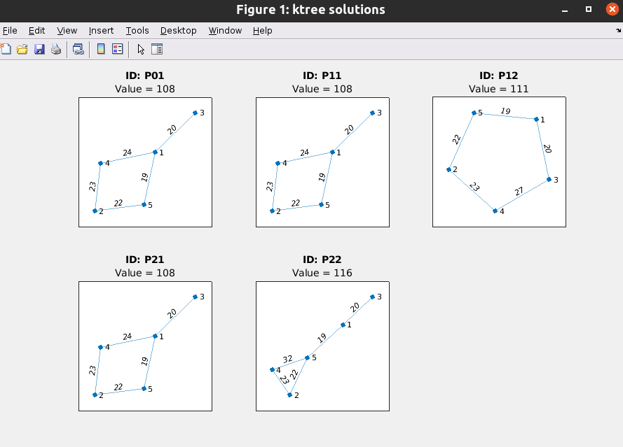

# Documentation 

- [Documentation](#documentation)
  - [Utils](#utils)
    - [log \& logging](#log--logging)
  - [Problems scripts](#problems-scripts)
    - [baseSolutionProblem](#basesolutionproblem)
    - [primalSimplex](#primalsimplex)
    - [Branch\&Bound symmetric TSP](#branchbound-symmetric-tsp)

## Utils

### log & logging

Set logging level with `logging` command

```matlab
logging info
logging debug
```

only logs with (level <= selected level) will be printed

```matlab
log.info("Hello World")
log.debug("x = %d", x)
```


---

## Problems scripts

### baseSolutionProblem
```matlab
[x, y] = baseSolutionProblem(c, A, b, baseIndex)
```
    given c, A, b in primal form notation
    will return:
          - primal base solution x
          - dual base solution y

    c vector (col or row)
    A matrix
    b vector (col or row)
    baseIndex vector 

Example
```matlab

c = [-7 1];
b = [4 -6 5 22 6 16];
A = [
  -3 2
  -1 -3
  0 1
  3 2
  1 0
  2 -1
];
[x,y] = baseSolutionProblem(c, A, b, [4 5]);
% x' = [ 6 2 ] 
% y' = [ 0 0 0 1/2 -17/2 0 ] 
```


### primalSimplex
```matlab
primalSimplex(c, A, b, baseIndex [, depthLimit])
```
    solve step by step, using primal simplex, the problem
        max c*x
        A*x <= b

    depthLimit: default = 2   max steps to do

Example
```matlab
c = [-7 1];
b = [4 -6 5 22 6 16];
A = [
    -3 2
    -1 -3
    0 1
    3 2
    1 0
    2 -1
    ];
i = [2, 5];
primalSimplex(c, A, b, i);
% will print 2 (default) steps of primal simplex, with all details: h,k indices, ratios ...

% ex.
% Primal Simplex step 1 
% 
%              key                   value        
%     ___________________    ____________________
%      base                   2 5                
%      x                      6 0                
%      y                      0 -1/3 0 0 -22/3 0 
%      f function value       -42                
%      h exiting index        2                  
%      k entering index       4                  
%      r ratios               33 15 6            
%      new base               4 5                
```
 


### Branch&Bound symmetric TSP 
```matlab
[sol, value] = SymmetricTSPBranchAndBound(table, nearestNode_root, ktree_root, variables)
```

```
This function is specifically for the problem of symmetric TSP, solved with Branch&Bound with:
- upper evaluation: nearest node algorithm
- lower evaluation: K-Tree, Kruskal's algorithm 

Inputs:
  table: full table of cost, a square matrix
  nearestNode_root: starting node for nearest algorithm 
  ktree_root: starting node for ktree
  variables: sequence of variables to instantiate in branch&bound, in this case in the form of matrix of variables indices

```

- The function will plot the ktree solution of every B&B step


Example 
```matlab
A = [
    0 20 24 21 32
    0 0 17 30 19
    0 0 0 22 18
    0 0 0 0 25
    0 0 0 0 0
    ];

% instantiate in order, variables x23, x24, x25
vars = [
    2 3
    2 4
    2 5
    ];

ktree_root = 5;
nearestNode_root = 1;

figure(Name = "ktree solutions")
[sol, value] = SymmetricTSPBranchAndBound(A, nearestNode_root, ktree_root, vars)

% WILL PRINT THIS

% >> run('./scripts/test/test_symmetricTSP_BnB.m')
% nearestNode solution: 
% cycle : 3 1 5 2 4 3 
% value: 111 
% 
% paused, press any key to proceed with step 1
% problem = 
%   struct with fields:
% 
%                    id: 1
%                  name: [0 1]
%         originalTable: [5x5 double]
%            ktreeTable: [5x5 double]
%       assignmentTable: [5x5 double]
%                    lb: [25x1 double]
%                    ub: [25x1 double]
%     decision_priority: [2x2 double]
% 
% Optimal solution found.
% 
% subproblem seems admissible
% 
% subproblem lower value: 108 
% current upper value: 111 
% 
% branching
% 
% paused, press any key to proceed with step 2
% ...

```